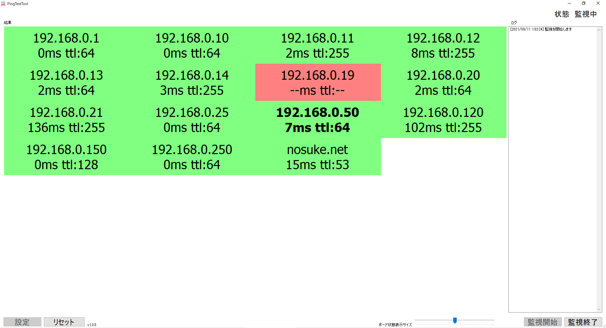

# Description
Send PING to multiple devices. Then monitor the device. This software is for Windows.

# ソフトウェアの説明
複数の端末にICMPパケットを送信し、ネットワークの状況を監視するプログラムです。

# ソフトウェア言語
- c#
- .NET Framework 4.7.2

# ソフトウェア開発環境
- Microsoft Visual Studio Professional 2019

## スクリーンショット


# アドレスの設定
以下のように、改行して記述します。
```
192.168.0.1
192.168.0.10
192.168.0.11
192.168.0.12
192.168.0.13
192.168.0.14
192.168.0.19
192.168.0.20
192.168.0.21
192.168.0.25
192.168.0.50
192.168.0.120
192.168.0.150
192.168.0.250
nosuke.net
```